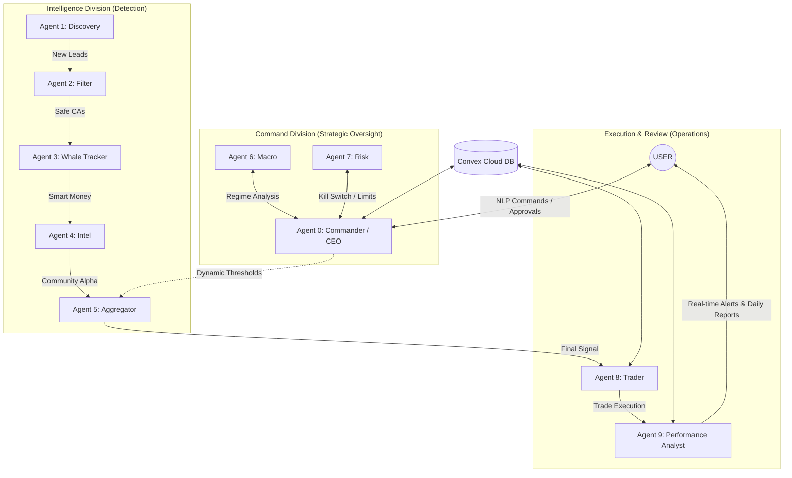

# 🏦 Nine-Agent Autonomous Trading Firm

**The definitive Solana memecoin intelligence engine. Engineered for precision. Built for autonomy.**

[](LICENSE)
[](https://www.python.org/)
[](https://nodejs.org/)
[](docker-compose.yml)

---

## 🌩️ The Problem: The Proliferation of "Noise"
Trading Solana memecoins is a high-stakes arena where **90% of retail traders lose capital** within 24 hours. The primary hurdles include:
*   **Velocity of Scams**: New "rugs" and honey-pots launch every 60 seconds.
*   **Information Overload**: Monitoring Pump.fun, DexScreener, Twitter, and On-chain data manually is biologically impossible.
*   **Emotional Slippage**: Fear and FOMO lead to inconsistent execution and blown accounts.

## 🏛️ The Solution: A Decentralized "Firm" Architecture
We have replaced the emotional trader with a **9-Agent Autonomous Firm**. This system doesn't just "trade"—it performs deep intelligence cross-referencing, multi-layered safety checks, and disciplined risk-managed execution.

**Key Differentiation**:
- **Multi-Agent Consensus**: No trade is executed without approval from the Intelligence (Agents 1-5), Command (Agents 6-7), and Review (Agent 9) divisions.
- **Async-First Engineering**: Built on a fully asynchronous Python core, allowing the bot to scan 100+ tokens in parallel while monitoring existing positions.
- **Institutional Guardrails**: Strict Kill-Switch mechanisms (Tier 1-3) that protect capital during macro volatility.

---

## 🔄 The User Journey
1.  **Deploy**: Launch the firm with a single command: `.\start-app.bat` (or `docker compose up`).
2.  **Monitor**: Connect via Telegram to receive real-time signal justifications and strategic reports.
3.  **Refine**: Issue NLP commands (e.g., `/pause`, `/model haiku`) to adjust the firm's strategy.
4.  **Analyze**: Review the daily trade journal generated by Agent 9 to refine the "Firm's" edge.

---

## 🏗️ System Architecture



---

## 🤖 Agent Roster

| Agent | Role | File | Description |
| :--- | :--- | :--- | :--- |
| **A0** | Commander / CEO | `agent_0_commander.py` | Central orchestrator. Receives NLP commands via Telegram, consults A6/A7, and issues strategic orders. |
| **A1** | Discovery | `agent_1_discovery.py` | Scans DexScreener, Pump.fun, and Helius for new token leads. |
| **A2** | On-Chain Filter | `agent_2_on_chain_analyst.py` | Filters tokens for rug-pull indicators, liquidity checks, and holder analysis. |
| **A3** | Whale Tracker | `agent_3_wallet_tracker.py` | Monitors smart-money wallet activity and flags insider accumulation. |
| **A4** | Community Intel | `agent_4_intel_agent.py` | Scrapes Telegram alpha channels (via Telethon) for contract addresses and sentiment. |
| **A5** | Signal Aggregator | `agent_5_signal_aggregator.py` | Cross-references all agent scores into a composite signal with a configurable gate threshold. |
| **A6** | Macro Sentinel | `agent_6_macro_sentinel.py` | Monitors BTC/SOL macro trends (50-EMA, 3-condition downtrend detection) to block trades during volatility. |
| **A7** | Risk Manager | `agent_7_risk_manager.py` | Enforces hard position limits, daily loss caps, and the automated 3-Tier Kill Switch. |
| **A8** | Trader | `agent_8_trading_bot.py` | Executes on-chain swaps via Solana RPC, manages SL/TP, and monitors open positions. |
| **A9** | Performance Analyst | `agent_9_performance_analyst.py` | Generates daily reports, sends real-time Telegram trade alerts, and tracks PnL. |

---

## ⚡ Core Features

*   **🕵️ 9-Agent Synergy**: Specialized roles from "Macro Sentinel" to "Whale Tracker" ensuring 360-degree token analysis.
*   **🛡️ 3-Tier Kill Switch**: A 3-Stage institutional-grade lockout system (Caution → Defense → Full Stop) for maximum capital protection.
*   **☁️ Convex Persistence**: Unified cloud database for signals, trades, agent states, and kill-switch audit logs.
*   **🤖 Double-LLM Intelligence**: Powered by Claude Sonnet for high-accuracy macro research and Haiku for lightning-fast real-time scoring.
*   **💬 Commander Interface**: A semi-autonomous NLP interface allowing you to issue strategic orders to the "Managing Director" via Telegram.

---

## 📋 Prerequisites

Before you begin, ensure you have the following:

| Requirement | Version | Purpose |
| :--- | :--- | :--- |
| [Python](https://www.python.org/downloads/) | 3.10+ | Backend logic and all 9 agents |
| [Node.js](https://nodejs.org/) | 18+ | WebSocket server & frontend |
| [Git](https://git-scm.com/) | Latest | Version control |
| [Convex Account](https://www.convex.dev/) | Free Tier | Cloud database (signals, trades, state) |
| [Anthropic API Key](https://console.anthropic.com/) | — | LLM intelligence (Claude Sonnet & Haiku) |
| [Telegram Bot Token](https://core.telegram.org/bots#botfather) | — | Bot alerts and Commander interface |

**Optional (for enhanced data):**
| Requirement | Purpose |
| :--- | :--- |
| [Helius API Key](https://helius.dev/) | Premium Solana RPC for on-chain analysis |
| [Birdeye API Key](https://birdeye.so/) | Token price and market data |
| [Solscan API Key](https://solscan.io/) | Contract and holder analytics |
| [Docker](https://www.docker.com/) | Containerized deployment (VPS) |

---

## ⚡ Quick Start (Local — Windows)

```bash
# 1. Clone the repository
git clone https://github.com/Subhamcode16/Crypto-trading-firm.git
cd Crypto-trading-firm

# 2. Set up the Backend
cd backend
python -m venv venv
.\venv\Scripts\activate
pip install -r requirements.txt

# 3. Configure Secrets
copy secrets.env.template secrets.env
# ✏️ Open secrets.env and fill in your API keys

# 4. Set up the Frontend
cd ..\frontend
npm install

# 5. Set up the WebSocket Server
cd ..\server
npm install

# 6. Set up Convex (from root directory)
cd ..
npx convex dev
# Follow the prompts to link to your Convex project

# 7. Launch Everything
.\start-app.bat
```

This will open **4 terminal windows**:
| Window | Service | Port |
| :--- | :--- | :--- |
| BACKEND | Bot Logic (Python) | — |
| API | Admin API (FastAPI) | `8000` |
| SERVER | WebSocket Bridge (Node.js) | `8080` |
| FRONTEND | Dashboard (Vite + React) | `5173` |

Open **http://localhost:5173** to view the pixel-art office dashboard.

---

## 🐳 Docker Deployment (Linux / VPS)

```bash
# 1. Clone the repository
git clone https://github.com/Subhamcode16/Crypto-trading-firm.git
cd Crypto-trading-firm

# 2. Configure Environment
cp docker.env.template .env
# ✏️ Open .env and fill in your API keys

# 3. Build & Launch
docker compose build
docker compose up -d

# 4. Monitor Logs
docker compose logs -f bot     # Watch the trading bot
docker compose logs -f api     # Watch the admin API
```

Access the dashboard at **http://\<VPS_IP\>:5173**

> [!NOTE]
> The Docker setup runs 4 services: `bot` (Python trading logic), `api` (FastAPI admin), `websocket` (Node.js event bridge), and `frontend` (React dashboard served via nginx).

---

## 🔑 Environment Variables Reference

| Variable | Required | Description |
| :--- | :---: | :--- |
| `TELEGRAM_BOT_TOKEN` | ✅ | Telegram bot token from [@BotFather](https://t.me/BotFather) |
| `TELEGRAM_CHAT_ID` | ✅ | Your Telegram chat ID for alerts |
| `TELEGRAM_API_ID` | ❌ | Telethon user-account API ID (for Agent 4 channel scraping) |
| `TELEGRAM_API_HASH` | ❌ | Telethon user-account API hash |
| `TELEGRAM_READER_PHONE` | ❌ | Phone number for Telethon session |
| `ANTHROPIC_API_KEY` | ✅ | Anthropic API key for Claude LLM |
| `SOLANA_RPC_URL` | ❌ | Custom Solana RPC endpoint (defaults to public mainnet) |
| `HELIUS_API_KEY` | ❌ | Helius premium RPC key |
| `BIRDEYE_API_KEY` | ❌ | Birdeye token data API key |
| `SOLSCAN_API_KEY` | ❌ | Solscan analytics API key |
| `TWITTER_USERNAME` | ❌ | Twitter/X username (cookie-based auth via `twikit`) |
| `TWITTER_EMAIL` | ❌ | Twitter/X email |
| `TWITTER_PASSWORD` | ❌ | Twitter/X password |
| `CONVEX_URL` | ✅ | Convex deployment URL (Docker only) |
| `ADMIN_API_KEY` | ❌ | API key for admin endpoints (Docker only) |
| `INITIAL_CAPITAL` | ❌ | Starting capital in SOL (default: `10.0`) |

---

## 📁 Project Structure

```
Crypto-trading-firm/
├── backend/                    # Python — All trading logic
│   ├── src/
│   │   ├── agents/             # The 9 agents (A0–A9)
│   │   ├── analysis/           # AI scorer, sentiment, rug detector
│   │   ├── apis/               # Helius, DexScreener, Solscan clients
│   │   ├── config/             # Runtime config (config.json)
│   │   ├── ml/                 # XGBoost ML pipeline
│   │   ├── utils/              # Convex client, helpers
│   │   ├── main.py             # Entry point — initializes all agents
│   │   ├── server.py           # FastAPI admin API
│   │   └── telegram_bot.py     # Telegram interface
│   ├── requirements.txt
│   └── secrets.env.template    # ← Copy to secrets.env
│
├── frontend/                   # React + Vite — Pixel-art dashboard
│   ├── src/
│   │   ├── components/         # Canvas renderer, UI overlays
│   │   ├── stores/             # Zustand state management
│   │   └── logic/              # Event adapter, WebSocket bridge
│   └── package.json
│
├── server/                     # Node.js — WebSocket event bridge
│   ├── index.js
│   └── scenario_controller.js
│
├── convex/                     # Convex — Cloud DB schema & functions
│
├── docker-compose.yml          # Full-stack Docker deployment
├── docker.env.template         # ← Copy to .env for Docker
├── start-app.bat               # One-click Windows launcher
└── LICENSE                     # MIT License
```

---

## 🛠️ Tech Stack

| Layer | Technology |
| :--- | :--- |
| **Logic** | Python 3.10+ (Fully Async / Await) |
| **Database** | [Convex](https://www.convex.dev/) (Unified Cloud Persistence) |
| **LLM** | Anthropic Claude 3.5 (Sonnet & Haiku) |
| **Discovery** | DexScreener, Solscan, Helius, Pump.fun |
| **Frontend** | React + Custom Canvas Engine |
| **Infra** | Docker, FastAPI, WebSockets |

---

## 🌍 SaaS / Business Roadmap
This firm is designed to scale beyond a single user's account:
- **Phase 1 (Active)**: Proprietary high-confidence trading for individual deployment.
- **Phase 2 (Managed Services)**: Multi-wallet management and "Copy-Trading" features via the Commander hub.
- **Phase 3 (SaaS License)**: Performance-based licensing for professional trading groups.

---

## 🚀 Unique Innovations
1.  **The "Commander" Pattern**: A unique Agent 0 that acts as the Firm's CEO, consulting Macro and Risk agents before presenting proposals for your approval.
2.  **Autonomous Risk Tiering**: A hardware-level risk enforcement system that resets safety margins automatically based on PnL drawdowns.
3.  **Haiku Dynamic Fallback**: Intelligent model switching ensuring the system never fails due to API rate limits or costs.

---

## 🤝 Contributing

Contributions are welcome! Here's how to get started:

1.  **Fork** the repository
2.  **Create** a feature branch: `git checkout -b feature/your-feature`
3.  **Commit** your changes: `git commit -m "feat: add your feature"`
4.  **Push** to your fork: `git push origin feature/your-feature`
5.  **Open** a Pull Request

> [!IMPORTANT]
> Never commit API keys or secrets. Ensure `.env` and `secrets.env` are in `.gitignore` before pushing.

---

## ⚠️ Disclaimer

> [!CAUTION]
> **This software is for educational and research purposes only.** Trading cryptocurrencies involves significant financial risk. Past performance is not indicative of future results. The authors are not responsible for any financial losses incurred through the use of this software. Always do your own research (DYOR) and never trade with more than you can afford to lose.

---

## ⚖️ License

This project is licensed under the **MIT License** — see the [LICENSE](LICENSE) file for details.

**© 2026 Subham Rath** — Open-Source under MIT License.
