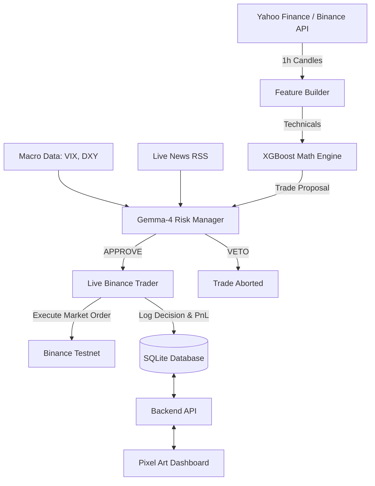

# 🏦 Pixel Firm v2: Autonomous Crypto Trading Engine

**The definitive AI-driven quantitative trading firm. Powered by XGBoost, LSTM, and Gemma-4 LLM.**

[](LICENSE)
[](https://www.python.org/)
[](https://nodejs.org/)

---

## 🌩️ The Evolution: From Multi-Agent to Quantitative AI
Pixel Firm v2 represents a complete architectural paradigm shift. We have moved away from the latency-heavy 9-Agent system and transitioned into a streamlined, high-frequency **Quantitative AI Engine**.

By fusing deep-learning predictive models (LSTM & XGBoost) with a hyper-intelligent LLM Risk Manager (Gemma-4), the bot now trades with mathematical precision while maintaining common-sense macro awareness.

## 🏛️ v2 Architecture: The Dual-Brain System
The core engine now operates on a **Dual-Brain** consensus mechanism:

1. **The Math Engine (Junior Analyst)**: Powered by XGBoost, it scans technical indicators across a rolling window of historical data from Yahoo Finance to predict the next price movement. If it finds a high-confidence setup (Conf > 35%), it proposes a `BUY` or `SELL` signal.
2. **The LLM Gatekeeper (Senior Risk Manager)**: Once a trade is proposed, the system wakes up the `Gemma-4-31B` model via OpenRouter. Gemma ingests the mathematical signal, current Macro Indicators (VIX, DXY), and live Crypto News (Decrypt, CoinDesk). Gemma has the ultimate authority to either `[APPROVE]` or `[VETO]` the trade to protect capital.

---

## 🔄 The Dashboard Experience
Pixel Firm is not just a script; it is a fully gamified trading firm.
1. **Deploy**: Launch the firm with a single command: `.\start-app.bat`.
2. **The Office**: A pixel-art interactive office environment serving as the hub for your virtual trading firm.
3. **The Neural Tab**: Watch the AI think in real-time. View live technical feature importance, current macro status, live news feeds, and Gemma's explicit `APPROVE`/`VETO` rationale.
4. **The Mission Tab**: Track your firm's profitability, active positions on the Binance Testnet, win/loss ratios, and gamification XP as you work towards the ultimate goal: The Grand Heist.

---

## 🏗️ System Components



---

## ⚡ Core Features

*   **📈 Machine Learning Core**: Utilizes pre-trained XGBoost models for rapid technical pattern recognition across BTC, ETH, and SOL.
*   **🛡️ LLM Risk Gatekeeper**: Seamless integration with OpenRouter's `google/gemma-4-31b-it:free` to provide human-like risk management and contextual awareness.
*   **🏦 Live Binance Testnet**: Executes real market orders in a sandbox environment without risking actual capital. Built-in anti-double-dipping protections prevent over-leveraging.
*   **💾 Local SQLite Persistence**: All trades, AI decisions (`ai_logs`), and gamification states are saved locally. No cloud database dependencies required.
*   **🎮 Gamified UI**: A stunning, custom-built pixel art React frontend that visualizes the AI's internal thought process and tracks your firm's level progression.

---

## 📋 Prerequisites

| Requirement | Purpose |
| :--- | :--- |
| [Python](https://www.python.org/downloads/) (3.10+) | Backend logic, ML Engine, and API |
| [Node.js](https://nodejs.org/) (18+) | WebSocket server & Vite frontend |
| [Binance Account](https://testnet.binance.vision/) | Testnet API Keys for Paper Trading |
| [OpenRouter API Key](https://openrouter.ai/) | Free API key for Gemma-4 LLM inference |

---

## ⚡ Quick Start (Windows)

```bash
# 1. Clone the repository
git clone https://github.com/Subhamcode16/Crypto-trading-firm.git
cd Crypto-trading-firm

# 2. Set up the Backend
cd backend
python -m venv venv
.\venv\Scripts\activate
pip install -r requirements.txt

# 3. Configure Secrets
copy secrets.env.template secrets.env
# ✏️ Open secrets.env and fill in your BINANCE TESTNET keys and OPENROUTER_API_KEY

# 4. Set up the Frontend
cd ..\frontend
npm install

# 5. Set up the WebSocket Server
cd ..\server
npm install

# 6. Launch the Firm
cd ..
.\start-app.bat
```

This will automatically launch the **FastAPI Backend**, the **Node.js WebSockets**, and the **Vite Dashboard**. 
Open **http://localhost:5173** in your browser to enter the Pixel Firm.

---

## ⚠️ Disclaimer

> [!CAUTION]
> **This software is for educational and research purposes only.** The v2 engine is currently configured for the Binance Testnet. If you modify the code to connect to a live exchange, you do so at your own risk. The authors are not responsible for any financial losses. 

## ⚖️ License
This project is licensed under the **MIT License**.
