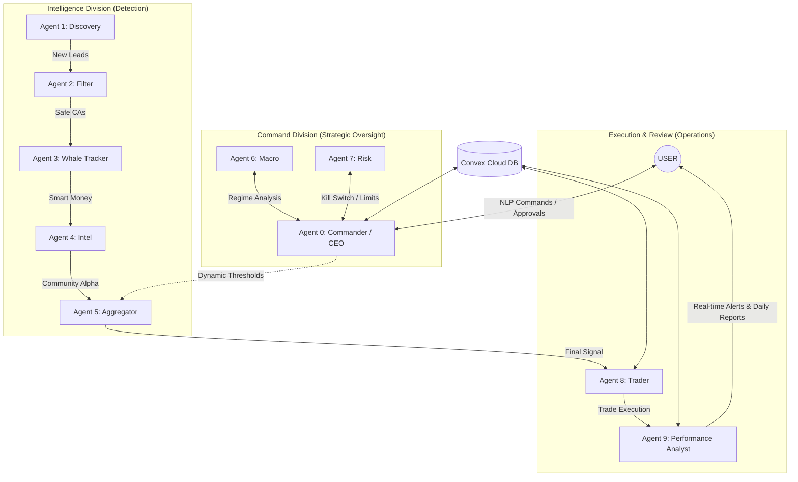

# 🏦 Nine-Agent Autonomous Trading Firm

**The definitive Solana memecoin intelligence engine. Engineered for precision. Built for autonomy.**

---

## 🌩️ The Problem: The Proliferation of "Noise"
Trading Solana memecoins is a high-stakes arena where **90% of retail traders lose capital** within 24 hours. The primary hurdles include:
*   **Velocity of Scams**: New "rugs" and honey-pots launch every 60 seconds.
*   **Information Overload**: Monitoring Pump.fun, DexScreener, Twitter, and On-chain data manually is biologically impossible.
*   **Emotional Slippage**: Fear and FOMO lead to inconsistent execution and blown accounts.

## 🏛️ The Solution: A Decentralized "Firm" Architecture
We have replaced the emotional trader with a **9-Agent Autonomous Firm**. This system doesn't just "trade"—it performs deep intelligence cross-referencing, multi-layered safety checks, and disciplined risk-managed execution.

**Key Differentiation**:
- **Multi-Agent Consensus**: No trade is executed without approval from the Intelligence (Agents 1-5), Command (Agents 6-7), and Review (Agent 9) divisions.
- **Async-First Engineering**: Built on a fully asynchronous Python core, allowing the bot to scan 100+ tokens in parallel while monitoring existing positions.
- **Institutional Guardrails**: Strict Kill-Switch mechanisms (Tier 1-3) that protect capital during macro volatility.

---

## 🔄 The User Journey
1.  **Deploy**: Launch the firm with a single command: `.\start-app.bat`.
2.  **Monitor**: Connect via Telegram to receive real-time signal justifications and strategic reports.
3.  **Refine**: Issue NLP commands (e.g., `/pause`, `/model haiku`) to adjust the firm's strategy.
4.  **Analyze**: Review the daily trade journal generated by Agent 9 to refine the "Firm's" edge.

---

## 🏗️ System Architecture

---

## ⚡ Core Features

*   **🕵️ 9-Agent Synergy**: Specialized roles from "Macro Sentinel" to "Whale Tracker" ensuring 360-degree token analysis.
*   **🛡️ 3-Tier Kill Switch**: Integrated Stop-Loss, Trailing Profits, and a 3-Stage institutional-grade lockout system (Caution, Defense, Full Stop) for maximum capital protection.
*   **☁️ Convex Persistence**: Industry-standard database persistence for signals, trades, and agent states, ensuring zero data loss.
*   **🤖 Double-LLM Intelligence**: Powered by Claude 3.5 Sonnet for high-accuracy macro research and Haiku for lightning-fast real-time scoring.
*   **💬 Commander Interface**: A semi-autonomous NLP interface allowing you to issue strategic orders to the "Managing Director" via Telegram.

---

## 🌍 SaaS / Business Roadmap
This firm is designed to scale beyond a single user's account:
- **Phase 1 (Active)**: Proprietary high-confidence trading for individual deployment.
- **Phase 2 (Managed Services)**: Multi-wallet management and "Copy-Trading" features via the Commander hub.
- **Phase 3 (SaaS License)**: Performance-based licensing for professional trading groups.

---

## 🛠️ Tech Stack

| Layer | Technology |
| :--- | :--- |
| **Logic** | Python 3.10+ (Fully Async / Await) |
| **Database** | [Convex](https://www.convex.dev/) (Unified Cloud Persistence) |
| **LLM** | Anthropic Claude 3.5 (Sonnet & Haiku) |
| **Discovery** | DexScreener, Solscan, Helius, Pump.fun |
| **Frontend** | React + Custom Custom Canvas Engine |

---

## 🚀 Unique Innovations
1.  **The "Commander" Pattern**: A unique Agent 0 that acts as the Firm's CEO, consulting Macro and Risk agents before presenting proposals for your approval.
2.  **Autonomous Risk Tiering**: A hardware-level risk enforcement system that resets safety margins automatically based on PnL drawdowns.
3.  **Haiku Dynamic Fallback**: Intelligent model switching ensuring the system never fails due to API rate limits or costs.

---
*Proprietary Trading System - Designed for Absolute Autonomy.*
